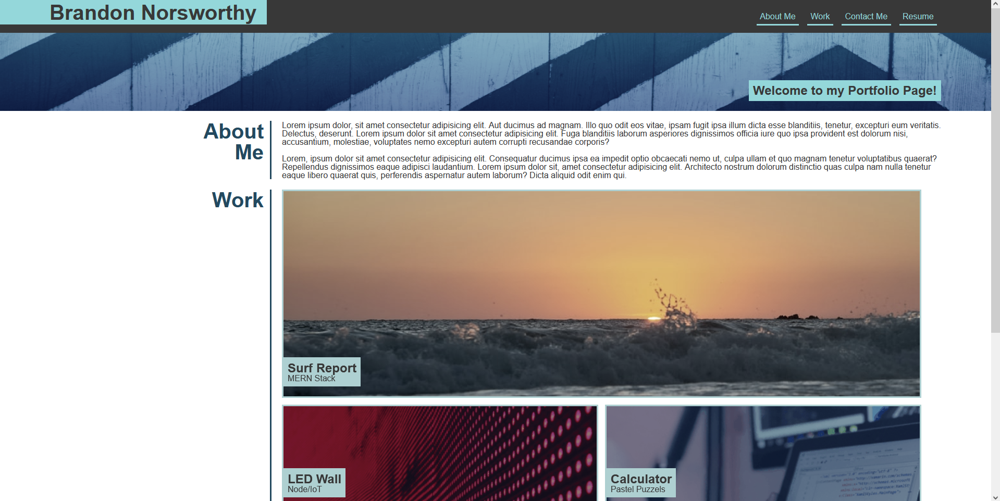

https://brandonnorsworthy.github.io/portfolio-website/

# About This Deployment
First personal portfolio as an assignment responsive layout with ability to add more elements where needed and will be automatically formatted accordingly

# Below Demonstrates Responsiveness
## Desktop Screen

## Narrow Screen

## Mobile Application

# Acceptance Criteria
- Presented with name, recent photo, and links to sections (# href), about them, work, and how to contact them
- Clicking navbar links scrolls down to the corresponding section
- first application should be larger than the rest
- when click on applications takes to deployed application (fake)
- responsive layout

# More Criteria Personal Checklist
- deployed
- no errors
- github url
- resembles the mockup functionality
- Repository has a unique name.
- Repository follows best practices for file structure and naming conventions.
- Repository follows best practices for class/id naming conventions, indentation, quality comments, etc.
- Repository contains multiple descriptive commit messages.
- Repository contains quality readme with description, screenshot, link to deployed application.